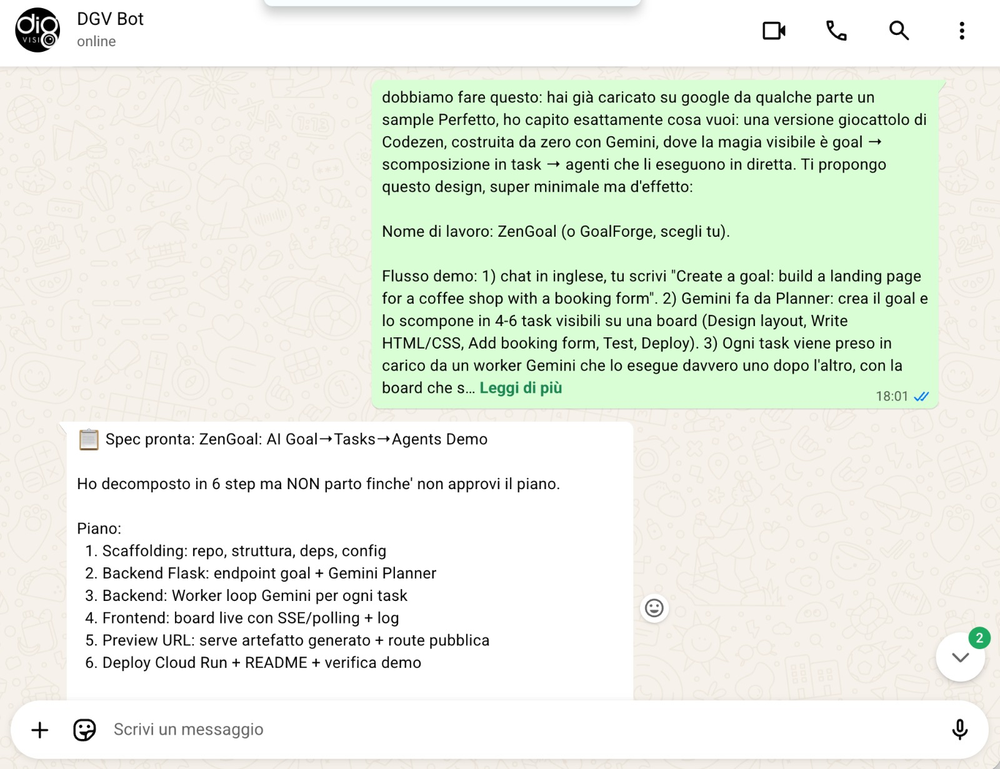

# ZenGoal — Prompt History

This is the full prompt history used to build the ZenGoal prototype during the
Stanford × DeepMind Hackathon (July 19, 2026). The prototype was built with an
AI coding agent driven by these prompts, in this order. **Gemini is the LLM that
powers every intelligent step of the product itself** (transcription, planning,
agent workers, intent routing, and text-to-speech).

Each prompt below corresponds to a real build increment — you can follow them
in the commit history of this repository.

---

## 1 — Core app: voice memo → goal

> Build a single-file Flask app called ZenGoal: an endpoint receives a voice
> memo with a business idea, transcribes it with Gemini 3 Flash (multimodal,
> inline audio), distills it into ONE clear business goal, and returns a goal
> ID. Keep all state in memory, no database.

## 2 — Planner: goal → agent tasks

> Add a planner step: given the transcribed idea, have Gemini write the goal
> and decompose it into 4-6 executable tasks, each assigned to a specialized
> agent role (Strategist, Copywriter, Designer, Developer, QA). Return strict
> JSON.

## 3 — Worker loop: agents ship a real deliverable

> Add a worker loop: each task is executed sequentially by a Gemini agent that
> receives the goal, its task, and the accumulated context from previous tasks.
> The final task must assemble everything into a complete, self-contained HTML
> landing page as the shipped deliverable.

## 4 — Live kanban UI with in-browser voice recording

> Create a live kanban web UI with vanilla JS: in-browser voice recording via
> MediaRecorder, tasks moving from queued to running to done with live logs
> (1.2s polling), and a preview panel. When the pipeline finishes, show an
> approval request instead of auto-shipping — the system must ask permission.

## 5 — Hosted deliverable + Cloud Run deploy

> Serve the generated deliverable at a public preview URL (/preview/<goal_id>)
> so the shipped product is a real hosted page, not a mockup. Deploy everything
> on Google Cloud Run.

## 6 — WhatsApp channel (Baileys bridge)

> Build a WhatsApp bridge with Baileys on Node 20: incoming voice memos are
> downloaded and posted to the ZenGoal API; the bridge polls the pipeline and
> sends milestone messages (goal set, pipeline created, each task done,
> awaiting approval with preview link). Replying 'approve' ships the product.

## 7 — Spoken replies (Gemini TTS)

> Add spoken replies: when the pipeline completes, generate a voice note with
> Gemini 2.5 Flash TTS, convert the 24kHz PCM to ogg/opus with ffmpeg, and send
> it as a WhatsApp voice message (ptt).

## 8 — Intent router: idea vs chat

> Add a Gemini intent router to the bridge: classify each incoming text as
> 'business idea' or 'casual chat'. Ideas start the pipeline; chat gets a short
> friendly reply as ZenGoal inviting the user to send a voice memo. Reply only
> with JSON.

## 9 — Demo hardening

> Harden for the demo: persist the WhatsApp session on a Cloud Storage volume
> so container restarts don't unlink the device, retry failed sends, and serve
> the pairing QR as an auto-refreshing web page.

---

## Chat history

The prototype was driven entirely from a **WhatsApp chat with our AI dev agent** —
the same conversational workflow the product itself demonstrates. Here is the
actual chat where the build was specified and the plan approved:

The agent decomposed the request into a 6-step plan (scaffolding → Flask backend
with Gemini planner → Gemini worker loop → live board → public preview URL →
Cloud Run deploy) and waited for explicit approval before starting — the same
approval-gate philosophy ZenGoal ships with.

---

## Gemini models used in the product

| Step | Model |
|---|---|
| Voice transcription (multimodal audio) | `gemini-3-flash-preview` |
| Goal distillation & planning (strict JSON) | `gemini-3-flash-preview` |
| Agent workers (Strategist → QA) | `gemini-3-flash-preview` |
| WhatsApp intent routing | `gemini-3-flash-preview` |
| Spoken voice-note replies | `gemini-2.5-flash-preview-tts` |
